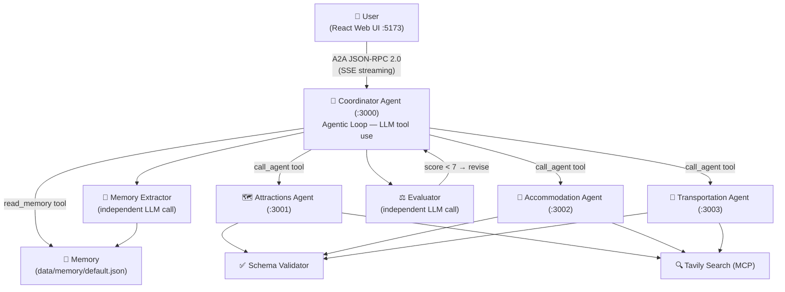

# Travel Agent Coordinator

A multi-agent travel planning system built on [Google's A2A Protocol](https://google.github.io/A2A/) — demonstrating how independent AI agents discover, communicate, and collaborate via JSON-RPC 2.0.

## Architecture



### How a request flows

```
1. read_memory()          — load stored user preferences
2. ask_user() (if needed) — clarify destination or duration
3. call_agent(attractions)  → JSON output → Schema Validator
4. call_agent(accommodation)→ JSON output → Schema Validator
5. call_agent(transportation)→JSON output → Schema Validator
6. Write final plan (text)
7. Evaluator scores plan (0–10). Score < 7 → revise (max 2 rounds)
8. extractAndSaveMemory() — save new preferences for next session
```

### Key components

| Component | Role |
|-----------|------|
| **Coordinator** | Agentic loop — LLM decides what to call and when |
| **Specialist Agents** | Attractions / Accommodation / Transportation — each outputs structured JSON |
| **Schema Validator** | Hard-checks agent JSON output; retries once with feedback on failure |
| **Evaluator** | Independent LLM scores the draft plan (0–10); injects feedback if score < 7 |
| **Memory Extractor** | Independent LLM extracts user preferences after each session |
| **Tavily MCP** | Real-time web search for attractions, hotels, transit routes |

### Dual-mode operation

Each sub-agent supports two modes, switchable via environment variable:

| Mode | How it works | When to use |
|------|-------------|-------------|
| `api` (default) | Coordinator calls LLM directly — no separate process needed | Local dev, quick testing |
| `a2a` | Each agent runs as an independent process; Coordinator sends real A2A JSON-RPC 2.0 requests | Demo, showcasing the full protocol |

## Quick Demo

Start the system and try this prompt:

> **"Plan me a 4-day Tokyo trip, budget $1000, 2 people, interested in temples and local food"**

You'll see the Coordinator's agentic loop in real time:
1. User preferences loaded from memory
2. Attractions specialist finds temple districts and food areas (returns structured JSON)
3. Accommodation specialist finds hotels near attraction zones (returns structured JSON)
4. Transportation specialist maps out transit options (returns structured JSON)
5. Coordinator synthesises a complete itinerary
6. Evaluator scores the plan — if below 7/10, the plan is revised
7. Preferences saved to memory for next session

## Features

- **Agentic Orchestrator** — LLM-driven dispatch via tool use; agents called dynamically, not hardcoded
- **Structured JSON output** — All specialist agents return typed JSON; Schema Validator enforces required fields with retry
- **Evaluator Agent** — Independent LLM scores each draft plan (0–10); score < 7 triggers up to 2 revision rounds
- **User Memory** — Preferences persist across sessions (`data/memory/default.json`); automatically applied to future plans
- **Request Logs** — Every request logged to browser localStorage; view step-by-step timeline in the Logs page
- **A2A Protocol** — Agents expose `/.well-known/agent-card.json` for capability discovery; communication follows A2A JSON-RPC 2.0
- **Real web data** — Tavily Search MCP integration fetches live attraction, hotel, and transit information
- **SSE streaming** — Real-time single-line progress display as each specialist is consulted
- **Multi-provider LLM** — Switch between Anthropic (Claude) and Google (Gemini) from the UI; no server restart needed
- **Configurable prompts** — Edit system prompts for each agent in the Settings page
- **Graceful degradation** — Schema validation failure falls back to plain text; evaluator failure is treated as passed

## Getting Started

### Prerequisites

- Node.js 18+
- An API key for Anthropic or Gemini (at least one)
- (Optional) A [Tavily](https://tavily.com) API key for real web search

### 1. Install dependencies

```bash
npm install
cd web && npm install && cd ..
```

### 2. Configure environment

```bash
cp .env.example .env
```

Edit `.env` and fill in your keys:

```env
# Pick one (or both)
ANTHROPIC_API_KEY=sk-ant-...
GEMINI_API_KEY=AIza...

# Default provider (anthropic | gemini)
LLM_PROVIDER=anthropic

# Optional — enables real web search for attractions/hotels/transit
TAVILY_API_KEY=tvly-...
```

### 3. Start

```bash
# Start everything: coordinator + all sub-agents + web UI
npm run dev:all

# Backend only (no web UI)
npm run dev:agents

# Kill all ports if something is stuck
npm run kill-ports
```

Open [http://localhost:5173](http://localhost:5173) in your browser.

## Project Structure

```
src/
├── agents/
│   ├── coordinatorExecutor.ts   # Agentic loop, evaluator, memory extraction
│   ├── attractionsAgent.ts      # Attractions AgentExecutor
│   ├── accommodationAgent.ts    # Accommodation AgentExecutor
│   └── transportationAgent.ts   # Transportation AgentExecutor
├── servers/
│   ├── attractionsServer.ts     # Express server :3001
│   ├── accommodationServer.ts   # Express server :3002
│   └── transportationServer.ts  # Express server :3003
├── services/
│   ├── llmClient.ts             # AnthropicClient / GeminiClient / factory + tool use
│   ├── agentRegistry.ts         # Agent calls, schema validation, Tavily enrichment
│   ├── promptStore.ts           # docs/prompts/*.md hot-reload
│   ├── schemaValidator.ts       # JSON schema validation for agent outputs
│   ├── memoryService.ts         # User preference persistence (data/memory/)
│   ├── tavilyMCPClient.ts       # Tavily Search MCP client (singleton)
│   └── taskStore.ts             # In-memory task state
└── index.ts                     # Coordinator entry point + API endpoints

web/
├── src/
│   ├── pages/
│   │   ├── ChatPage.tsx         # Conversation UI + single-line progress + log collection
│   │   ├── LogsPage.tsx         # Request history with step-by-step timeline
│   │   └── SettingsPage.tsx     # Prompt editor + provider selector + memory clear
│   └── App.tsx
└── vite.config.ts               # Proxies /api and /message to :3000

docs/
├── prompts/                     # System prompts for all agents (.md, hot-reloaded)
│   ├── coordinator.md
│   ├── attractions.md
│   ├── accommodation.md
│   ├── transportation.md
│   ├── evaluator.md
│   └── memory-extractor.md
└── *.md                         # Phase design documents
```

## Environment Variables

| Variable | Description | Default |
|----------|-------------|---------|
| `LLM_PROVIDER` | `anthropic` or `gemini` | `anthropic` |
| `ANTHROPIC_API_KEY` | Anthropic API key | — |
| `ANTHROPIC_MODEL` | Claude model ID | `claude-haiku-4-5-20251001` |
| `GEMINI_API_KEY` | Google Gemini API key | — |
| `GEMINI_MODEL` | Gemini model ID | `gemini-2.0-flash` |
| `TAVILY_API_KEY` | Tavily Search API key (optional) | — |
| `ATTRACTIONS_MODE` | `api` or `a2a` | `api` |
| `ACCOMMODATION_MODE` | `api` or `a2a` | `api` |
| `TRANSPORTATION_MODE` | `api` or `a2a` | `api` |
| `ATTRACTIONS_AGENT_URL` | Sub-agent URL (a2a mode) | `http://localhost:3001` |
| `ACCOMMODATION_AGENT_URL` | Sub-agent URL (a2a mode) | `http://localhost:3002` |
| `TRANSPORTATION_AGENT_URL` | Sub-agent URL (a2a mode) | `http://localhost:3003` |
| `PORT` | Coordinator port | `3000` |

## API Endpoints (Coordinator)

| Endpoint | Description |
|----------|-------------|
| `GET  /.well-known/agent-card.json` | A2A agent discovery |
| `POST /message/send` | Send a message (synchronous) |
| `POST /message/stream` | Send a message (SSE streaming) |
| `GET  /api/prompts` | Get current prompt configuration |
| `PUT  /api/prompts` | Update prompt configuration |
| `GET  /api/memory` | Read stored user memory |
| `DELETE /api/memory` | Clear stored user memory |
| `GET  /health` | Health check |

## Troubleshooting

**Ports already in use**
```bash
npm run kill-ports
```

**`ANTHROPIC_API_KEY` / `GEMINI_API_KEY` missing**
The server will start but requests will fail. Check your `.env` file and restart with `npm run dev:all`.

**Sub-agents not responding (a2a mode)**
Make sure you've set `ATTRACTIONS_MODE=a2a` etc. and that `npm run dev:all` started all four processes. Check each agent's health: `curl http://localhost:3001/health`

**Tavily search not working**
Tavily is optional. Without `TAVILY_API_KEY`, agents fall back to LLM knowledge. Add the key to `.env` and restart.

**Web UI shows blank page**
Make sure you ran `npm install` inside the `web/` directory, and that the coordinator is running on `:3000`.

## Roadmap

- [x] Phase 0 — Replace internal SDK with Anthropic SDK; build LLM abstraction layer
- [x] Phase 1 — Real A2A sub-agents with agent-card and health endpoints
- [x] Phase 1.5 — React web UI (chat + settings)
- [x] Phase 1.6 — Multi-provider LLM support (Anthropic + Gemini)
- [x] Phase 2 — MCP tool integration (Tavily Search for real attraction + hotel data)
- [x] Phase 3 — SSE streaming for real-time agent progress
- [x] Phase 3.5 — Transportation Agent + intent classification + prompt hot-reload
- [x] Phase 4 — Retry logic with exponential backoff; unified prompt system
- [x] Phase 5 — Agentic Orchestrator: LLM tool use drives agent dispatch
- [x] Phase 6 — Polish & demo readiness
- [x] Phase 7 — Evaluator Agent: independent quality scoring with feedback loop
- [x] Phase 8 — User Memory: cross-session preference persistence
- [x] Phase 9 — UX polish: single-line progress, response timing, request logs, improved memory extraction
- [x] Phase 10 — Structured output: agents return typed JSON; Schema Validator with retry
- [ ] Phase 11 — Map visualisation + itinerary export (.ics, PDF)
- [ ] Phase 12 — Multi-round refinement: partial updates without full regeneration
- [ ] Phase 13 — Budget calculation: itemised cost breakdown with overage alerts
- [ ] Phase 14 — Context awareness: weather, holidays, visa requirements

## License

Apache 2.0
